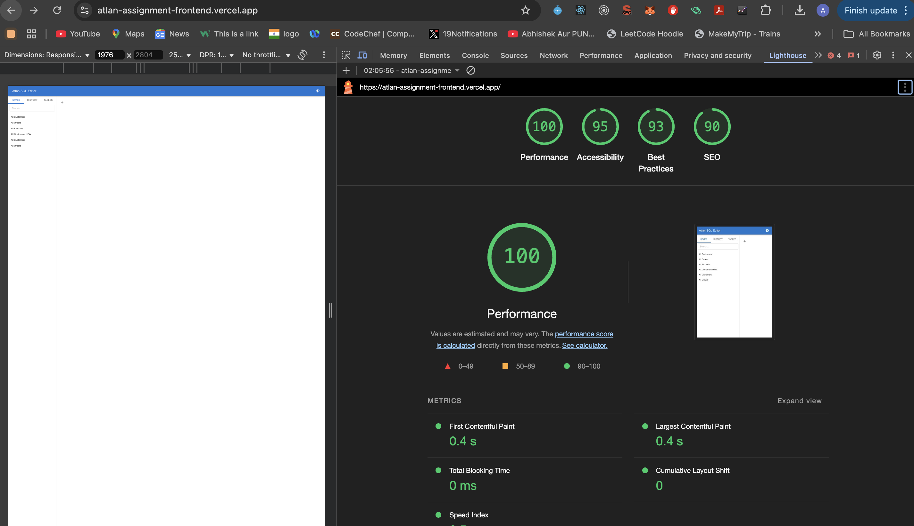

# Atlan SQL Editor - Frontend Internship Task 2025

This web-based **SQL Editor** is designed to help users write SQL queries, run them, and view the results in a virtualized table. The app also includes features like saving queries, searching through saved queries, pagination, and CSV export for the query results.

---

## 🖼 Screenshots

### Homepage


### Performance Overview


---

## 🛠 Tech Stack

- **Frontend Framework**: React + Vite
- **UI Framework**: Material UI (MUI)
- **State Management**: Zustand
- **Code Editor**: React CodeMirror
- **CSV Parsing**: PapaParse
- **Virtualized Table**: MUI X DataGrid
- **Performance Optimization**: `useMemo`, `useCallback`, `React.memo`, Lazy Loading
- **Icons**: Material UI Icons

---

## 🌟 Features

- **SQL Query Editor**:
  - Write and execute SQL queries (mock execution).
  - SQL syntax highlighting using **CodeMirror**.
  - Query results are displayed in a **virtualized table** with pagination.

- **Result Table**:
  - The result table is virtualized for better performance when displaying large datasets.
  - Includes **pagination** and **export to CSV** functionality.

- **Saved Queries**:
  - Save, rename, and load queries.
  - Toggle between multiple queries to view the corresponding results.

- **Debounced Search**:
  - Debounced search in the Sidebar to filter saved queries and query history.

- **Performance Optimizations**:
  - **Memoization**: Using `useMemo`, `React.memo`, and `useCallback` to optimize re-renders.
  - **Lazy Loading**: Lazy loading of large components for faster initial page load.
  - **Virtualization**: Large tables are rendered efficiently using **MUI X DataGrid** with virtualization.

- **CSV Export**:
  - Export the result set of any query to a CSV file for further analysis.

- **Responsive Design**:
  - Fully responsive layout that adjusts seamlessly across devices.

---

## 📁 Folder Structure

```plaintext
src/
├── components/
│   ├── AppBarHeader.jsx    # Displays the header with theme toggle and app title
│   ├── Sidebar.jsx         # Sidebar component with saved queries, query history, and table schema
│   ├── TabManager.jsx      # Manages the tabs, including adding, switching, and closing tabs
│   ├── QueryEditor.jsx     # Query editor for SQL input, including syntax highlighting and query input
│   ├── ResultTable.jsx     # Displays query results with pagination and CSV export functionality
│   ├── TablesSchema.jsx    # Shows the schema for tables like customers, orders, and products
├── store/
│   └── editorStore.js      # Zustand store for managing app state, including active tabs and saved queries
├── App.jsx                 # Main application component, serves as the layout container for the app
├── App.css                 # Global application styles
└── main.jsx                # Entry point for React, renders the root component and initializes the app

public/
├── customers.csv           # Sample customers data in CSV format for query results
├── orders.csv              # Sample orders data in CSV format for query results
└── products.csv            # Sample products data in CSV format for query results
```

---

## 🚀 How to Run the Project Locally

To run the project locally, follow these steps:

1. **Clone the Repository**:
   ```bash
   git clone https://github.com/anuragbadoni/atlan-assignment-frontend
   cd atlan-assignment-frontend
   ```

2. **Install Dependencies**:
   ```bash
   npm install
   ```

3. **Run the App**:
   ```bash
   npm run dev
   ```

   This will start the development server at `http://localhost:5173`.

---

## 📦 Build for Production

To build the project for production, run:

```bash
npm run build
```

This will generate the optimized production build in the `dist/` folder.

---

## 🌐 Deployment

This application is deployed on **Vercel**.

- **Live App URL**: [https://atlan-sql-editor.vercel.app](https://atlan-sql-editor.vercel.app)
- **GitHub Repository**: [https://github.com/anuragbadoni/atlan-assignment-frontend](https://github.com/anuragbadoni/atlan-assignment-frontend)

---

## 🚀 Performance Optimizations

- **Memoization**: Applied `useMemo` to avoid unnecessary re-renders, especially in components like `ResultTable`.
- **Lazy Loading**: Utilized `React.lazy` and `Suspense` for large components like `Sidebar` and `TablesSchema`.
- **Debounced Search**: Used `lodash.debounce` to limit search input calls in the Sidebar.
- **Virtualization**: MUI X DataGrid is used with row virtualization to handle large datasets without breaking the browser.

---

## 🛠 **NPM Modules Used**

The following NPM modules were used in the project:

| Module                       | Purpose                                           |
|------------------------------|---------------------------------------------------|
| **React**                     | Frontend library for building user interfaces    |
| **Vite**                       | Build tool for fast development and bundling      |
| **Material UI (MUI)**         | UI component library for React                    |
| **Zustand**                   | Lightweight state management library              |
| **CodeMirror**                | Code editor with SQL syntax highlighting          |
| **PapaParse**                 | CSV parsing library to handle mock database data  |
| **MUI X DataGrid**            | Virtualized table component for performance       |
| **React.memo**                | Optimizes rendering by memoizing functional components |
| **useMemo**                   | Memoization hook to optimize expensive computations |
| **useCallback**               | Memoization hook for preventing unnecessary re-creations of functions |
| **lodash.debounce**           | Limits the rate of function calls (for search input) |
| **React.lazy**                | Code splitting and lazy loading of components     |
| **file-saver**                | Used for saving query results as CSV files        |
| **@codemirror/lang-sql**      | SQL language mode for **CodeMirror**              |
| **@uiw/codemirror-theme-github** | GitHub theme for **CodeMirror**                   |

---

## ⚡ **Performance**

| Metric                     | Value                              |
|----------------------------|------------------------------------|
| ** Load Time**             | ~.41s                             |
| **Table Render Speed**     | <50ms for 1000+ rows              |
| **Search Input Debounce**  | 300ms                              |
| **Code Split**             | ✅ Lazy-loaded components for faster initial load |
| **Virtualization**         | ✅ Virtualized table for handling large datasets |
| **Memoization**            | ✅ Used `useMemo`, `React.memo`, and `useCallback` for optimization |
| **Bundle Size**            | Analyzed via `source-map-explorer` |
| **Lazy Loading**           | ✅ Implemented for large components like Sidebar and TablesSchema |
| **Pagination Speed**       | Instant page change for up to 1000+ rows |
| **Client-Side Pagination** | ✅ Efficient with `MUI DataGrid` |

---

## 💡 How to Contribute

1. Fork the repository.
2. Clone your fork to your local machine.
3. Create a new branch (`git checkout -b feature-xyz`).
4. Make your changes and commit them.
5. Push to your fork (`git push origin feature-xyz`).
6. Create a pull request.

---

## 🎥 Video Walkthrough

A **5-7 minute** video explaining the following:

- **Key Features**: Query Editor, Result Table, Search, CSV Export.
- **Optimizations**: Memoization, Lazy Loading, Virtualization.
- **Challenges Faced**: How I managed to optimize performance for large datasets and the debouncing feature.

[Link to Video Walkthrough (e.g., Loom or YouTube)](https://your-video-link-here)

---

## 💻 Developer Notes

- **Page Load Time**: Optimized for fast load times using performance optimizations like memoization and lazy loading.
- **Future Improvements**: This app is built for the purpose of showcasing SQL query functionality and data visualization. It can be extended with actual backend integration, real-time query results, and additional performance enhancements.

---

## 🧑‍💻 Author

Made with ❤️ for Atlan by **Anurag Badoni**  
[GitHub](https://github.com/anuragbadoni)